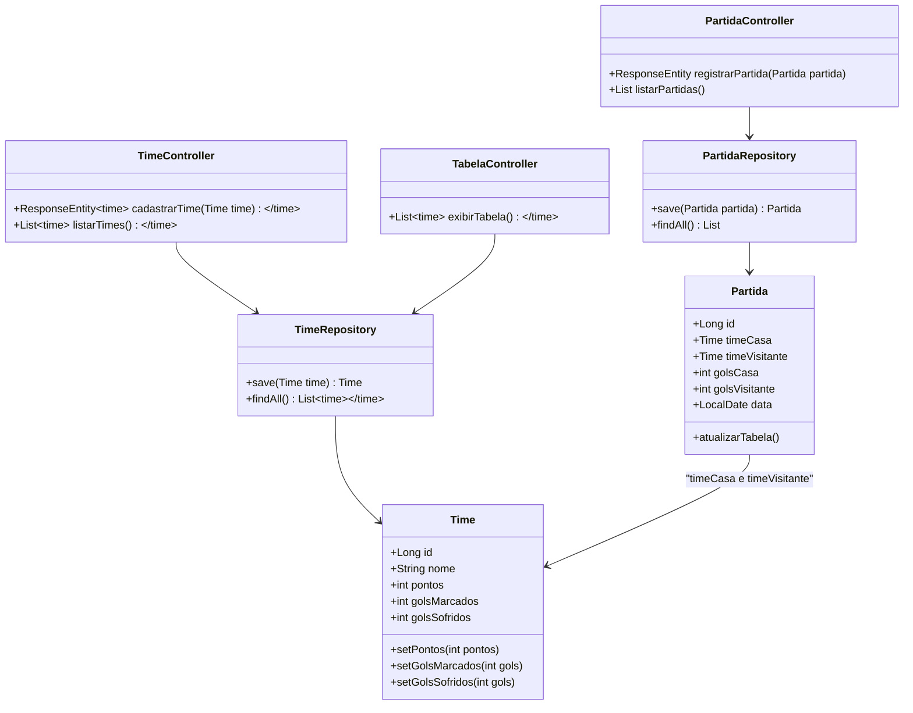

```mermaid
classDiagram
    class Time {
        +Long id
        +String nome
        +int pontos
        +int golsMarcados
        +int golsSofridos
        +setPontos(int pontos)
        +setGolsMarcados(int gols)
        +setGolsSofridos(int gols)
    }
    
    class Partida {
        +Long id
        +Time timeCasa
        +Time timeVisitante
        +int golsCasa
        +int golsVisitante
        +LocalDate data
        +atualizarTabela()
    }
    
    class TimeRepository {
        +save(Time time) Time
        +findAll() List<Time>
    }

    class PartidaRepository {
        +save(Partida partida) Partida
        +findAll() List<Partida>
    }

    class TimeController {
        +ResponseEntity<Time> cadastrarTime(Time time)
        +List<Time> listarTimes()
    }

    class PartidaController {
        +ResponseEntity<Partida> registrarPartida(Partida partida)
        +List<Partida> listarPartidas()
    }

    class TabelaController {
        +List<Time> exibirTabela()
    }

    TimeRepository --> Time
    PartidaRepository --> Partida
    TimeController --> TimeRepository
    PartidaController --> PartidaRepository
    TabelaController --> TimeRepository
    Partida --> Time : "timeCasa e timeVisitante"
```
