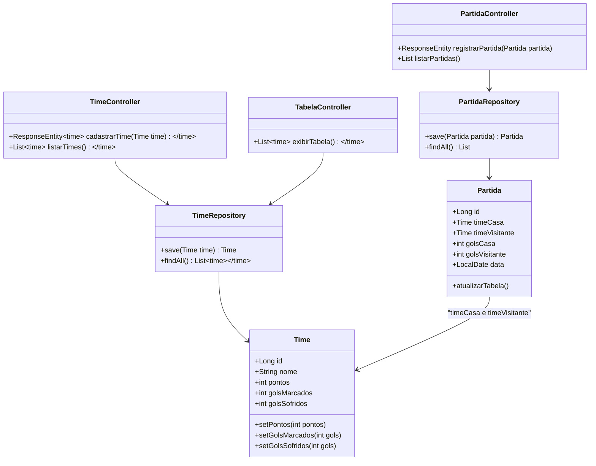

# Desafio de Projeto - API para Gerenciamento de Partidas de Futebol

Este projeto foi desenvolvido como parte de um bootcamp Java da Digital Innovation One (DIO) em parceria com o Bradesco. Durante o bootcamp, exercitei diversos conceitos de desenvolvimento em Java com Spring Framework, além de práticas recomendadas no mercado, como a criação de APIs REST, o uso de DTOs, configurações de banco de dados, documentação de API e muito mais.

## Tecnologias Utilizadas

- **Java 17** (versão LTS)
- **Spring Boot 3**: Para desenvolvimento da API REST.
- **Spring Data JPA**: Para interação com o banco de dados.
- **H2 Database**: Banco de dados em memória, utilizado para persistir os dados.
- **Swagger**: Para documentação da API, facilitando a visualização e interação com os endpoints.
- **Maven**: Gerenciador de dependências e build.

## Diagrama de classes


## Funcionalidades Implementadas

1. **Cadastro de Partidas**:
   - Endpoint para cadastrar uma partida de futebol, informando os times e o placar.
   - Utilização de um DTO (`PartidaRequest`) para simplificar o corpo da requisição.
   
2. **Atualização de Tabela**:
   - Após cada partida registrada, a tabela de classificação dos times é atualizada automaticamente.
   - O sistema contabiliza os gols e os pontos de cada time após cada partida.

3. **Ordenação por Pontos**:
   - A tabela é ordenada de acordo com os pontos dos times, seguindo as regras do campeonato.
   
4. **H2 Console**:
   - O H2 Console foi configurado para acessar diretamente o banco de dados e visualizar as tabelas de forma fácil e rápida.

5. **Swagger**:
   - A API é documentada e pode ser testada diretamente através do Swagger, com a visualização clara de todos os endpoints.

## Endpoints

### 1. **Cadastrar Partida**
- **POST** `/partidas`
- **Descrição**: Cadastra uma nova partida de futebol entre dois times.
- **Body (JSON)**:
```json
{
  "timeCasa": "Time A",
  "timeVisitante": "Time B",
  "golsCasa": 2,
  "golsVisitante": 1
}
```

### 2. **Listar Partidas**
- **POST** `/times`
- **Descrição**: Cadastra um time.

### 3. **Listar Times**
- **GET** `/times`
- **Descrição**: Retorna todos os times cadastrados, com seus pontos e gols.

### 4. **Obter Tabela de Classificação**
- **GET** `/tabela`
- **Descrição**: Exibe a tabela de classificação dos times, ordenada por pontos.

## Como Rodar o Projeto

### Requisitos

- **Java 17**
- **Maven** (opcional se você já tem o Spring Boot configurado)
- **IDE** (como IntelliJ IDEA, Eclipse, ou qualquer outra que preferir)

### Passos

1. Clone este repositório:

```bash
git clone https://github.com/seu-usuario/nome-do-repositorio.git
```

2. Navegue até o diretório do projeto:

```bash
cd nome-do-repositorio
```

3. Compile e rode o projeto:

```bash
mvn spring-boot:run
```

4. O projeto estará disponível em: `http://localhost:8080`

5. Acesse o Swagger para testar os endpoints: `http://localhost:8080/swagger-ui.html`

6. Para acessar o H2 Console, use a URL: `http://localhost:8080/h2-console`. A URL do banco é `jdbc:h2:mem:testdb` e o usuário e senha padrão são ambos `sa`.

## Considerações Finais

Este projeto foi desenvolvido como um exercício prático para aplicar os conceitos aprendidos durante o bootcamp. Utilizando **Spring Boot**, a API foi estruturada de forma simples, porém eficiente, com funcionalidades básicas de gerenciamento de partidas de futebol, atualização de tabela e documentação de API via Swagger.

